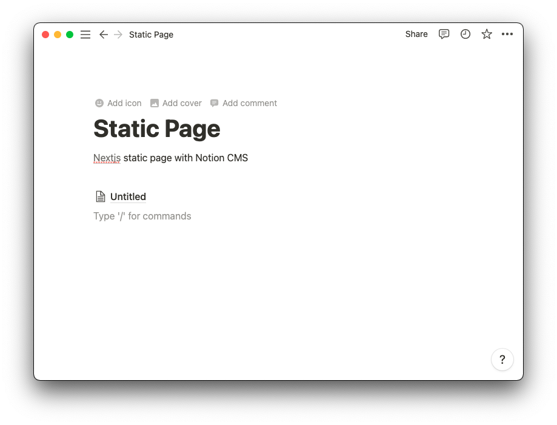
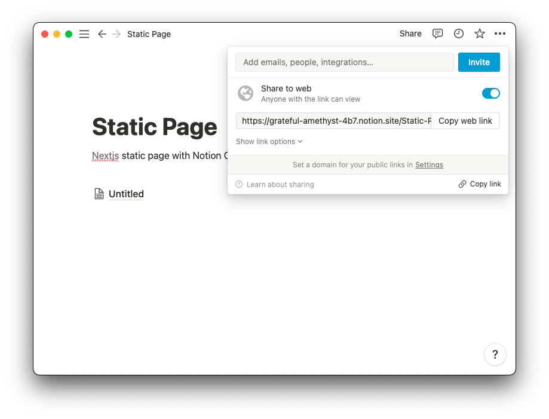
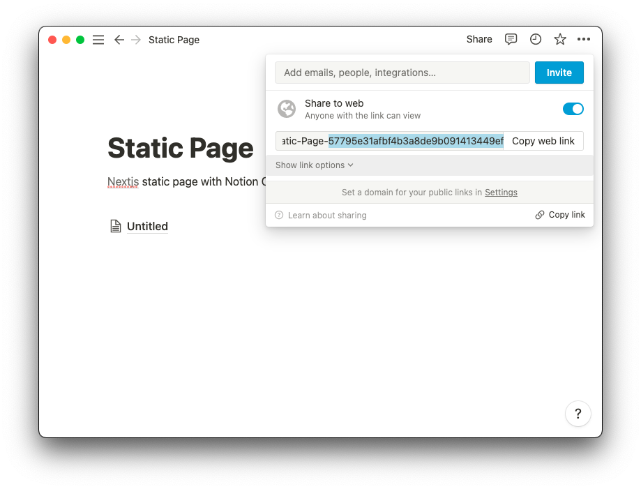
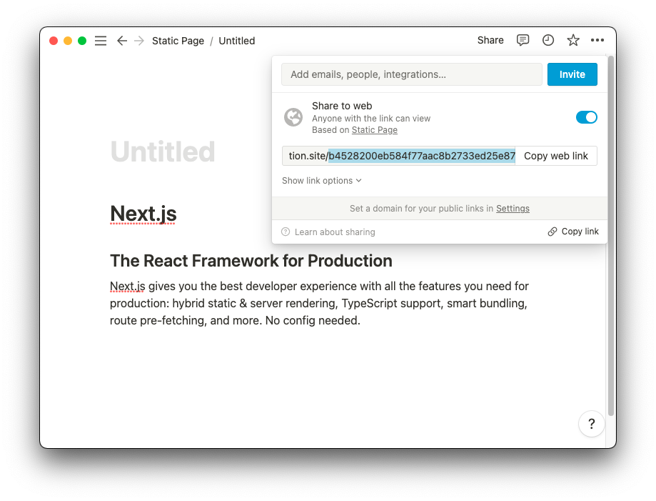

# Notion CMS Nextjs simple page

## Static notion page

- First, make page with notion
  
- Share web page
  
- Copy `rootNotionPageId`
  
- (optional) If you want to pre-rendered page, copy `pageId`
  

`rootNotionPageId` is in `lib/config.ts` and set target pre-rendered `pageId` in `getStaticPaths` of `src/pages/[pageId].tsx`.

done.

```
yarn dev
```

check `http://localhost:3000/b4528200eb584f77aac8b2733ed25e87`

## Demo

- Notion page: <https://grateful-amethyst-4b7.notion.site/b4528200eb584f77aac8b2733ed25e87>
- Deployed page: <https://notion-cms-nextjs-simple-page.vercel.app/b4528200eb584f77aac8b2733ed25e87>
